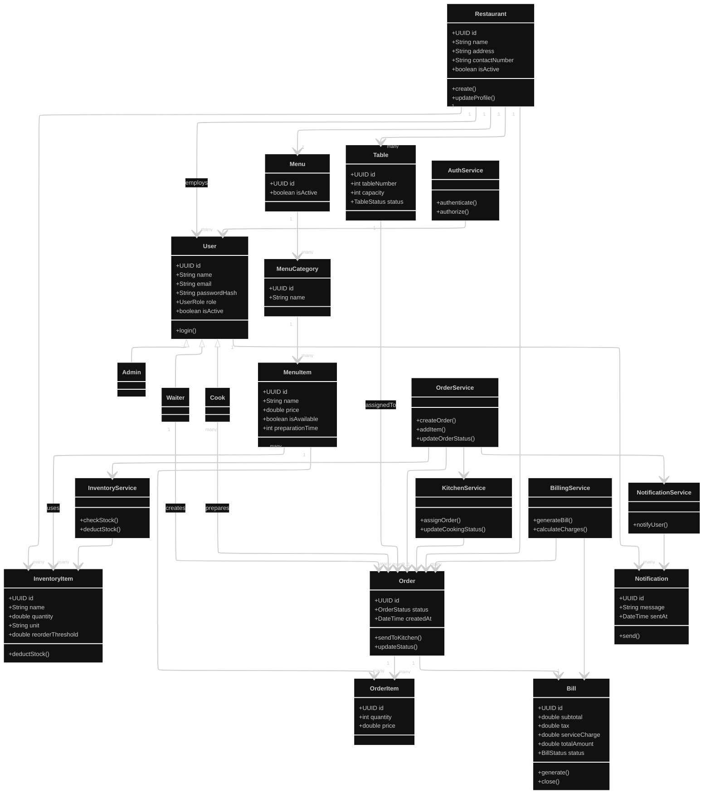

```mermaid
---
config:
  layout: elk
  theme: redux-dark
---
classDiagram
direction TB
    class Restaurant {
	    +UUID id
	    +String name
	    +String address
	    +String contactNumber
	    +boolean isActive
	    +create()
	    +updateProfile()
    }

    class User {
	    +UUID id
	    +String name
	    +String email
	    +String passwordHash
	    +UserRole role
	    +boolean isActive
	    +login()
    }

    class Admin {
    }

    class Waiter {
    }

    class Cook {
    }

    class Menu {
	    +UUID id
	    +boolean isActive
    }

    class MenuCategory {
	    +UUID id
	    +String name
    }

    class MenuItem {
	    +UUID id
	    +String name
	    +double price
	    +boolean isAvailable
	    +int preparationTime
    }

    class InventoryItem {
	    +UUID id
	    +String name
	    +double quantity
	    +String unit
	    +double reorderThreshold
	    +deductStock()
    }

    class Table {
	    +UUID id
	    +int tableNumber
	    +int capacity
	    +TableStatus status
    }

    class Order {
	    +UUID id
	    +OrderStatus status
	    +DateTime createdAt
	    +sendToKitchen()
	    +updateStatus()
    }

    class OrderItem {
	    +UUID id
	    +int quantity
	    +double price
    }

    class Bill {
	    +UUID id
	    +double subtotal
	    +double tax
	    +double serviceCharge
	    +double totalAmount
	    +BillStatus status
	    +generate()
	    +close()
    }

    class Notification {
	    +UUID id
	    +String message
	    +DateTime sentAt
	    +send()
    }

    class AuthService {
	    +authenticate()
	    +authorize()
    }

    class OrderService {
	    +createOrder()
	    +addItem()
	    +updateOrderStatus()
    }

    class InventoryService {
	    +checkStock()
	    +deductStock()
    }

    class KitchenService {
	    +assignOrder()
	    +updateCookingStatus()
    }

    class BillingService {
	    +generateBill()
	    +calculateCharges()
    }

    class NotificationService {
	    +notifyUser()
    }

    User <|-- Admin
    User <|-- Waiter
    User <|-- Cook
    Restaurant "1" --> "many" User : employs
    Restaurant "1" --> "1" Menu
    Menu "1" --> "many" MenuCategory
    MenuCategory "1" --> "many" MenuItem
    Restaurant "1" --> "many" InventoryItem
    MenuItem "many" --> "many" InventoryItem : uses
    Restaurant "1" --> "many" Table
    Restaurant "1" --> "many" Order
    Table "1" --> "0..1" Order : assignedTo
    Waiter "1" --> "many" Order : creates
    Order "1" --> "many" OrderItem
    MenuItem "1" --> "many" OrderItem
    Cook "many" --> "many" Order : prepares
    Order "1" --> "1" Bill
    User "1" --> "many" Notification
    AuthService --> User
    OrderService --> Order
    OrderService --> InventoryService
    OrderService --> KitchenService
    OrderService --> NotificationService
    InventoryService --> InventoryItem
    KitchenService --> Order
    BillingService --> Bill
    BillingService --> Order
    NotificationService --> Notification
```