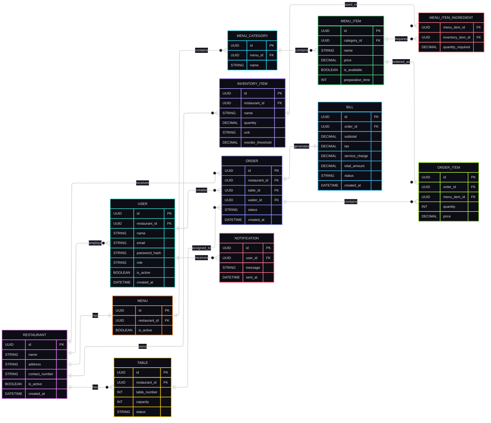

```mermaid
---
config:
  layout: elk
  theme: redux-dark-color
  look: neo
---
erDiagram
	direction LR
	RESTAURANT {
		UUID id PK ""  
		STRING name  ""  
		STRING address  ""  
		STRING contact_number  ""  
		BOOLEAN is_active  ""  
		DATETIME created_at  ""  
	}

	USER {
		UUID id PK ""  
		UUID restaurant_id FK ""  
		STRING name  ""  
		STRING email  ""  
		STRING password_hash  ""  
		STRING role  ""  
		BOOLEAN is_active  ""  
		DATETIME created_at  ""  
	}

	MENU {
		UUID id PK ""  
		UUID restaurant_id FK ""  
		BOOLEAN is_active  ""  
	}

	MENU_CATEGORY {
		UUID id PK ""  
		UUID menu_id FK ""  
		STRING name  ""  
	}

	MENU_ITEM {
		UUID id PK ""  
		UUID category_id FK ""  
		STRING name  ""  
		DECIMAL price  ""  
		BOOLEAN is_available  ""  
		INT preparation_time  ""  
	}

	INVENTORY_ITEM {
		UUID id PK ""  
		UUID restaurant_id FK ""  
		STRING name  ""  
		DECIMAL quantity  ""  
		STRING unit  ""  
		DECIMAL reorder_threshold  ""  
	}

	MENU_ITEM_INGREDIENT {
		UUID menu_item_id FK ""  
		UUID inventory_item_id FK ""  
		DECIMAL quantity_required  ""  
	}

	TABLE {
		UUID id PK ""  
		UUID restaurant_id FK ""  
		INT table_number  ""  
		INT capacity  ""  
		STRING status  ""  
	}

	ORDER {
		UUID id PK ""  
		UUID restaurant_id FK ""  
		UUID table_id FK ""  
		UUID waiter_id FK ""  
		STRING status  ""  
		DATETIME created_at  ""  
	}

	ORDER_ITEM {
		UUID id PK ""  
		UUID order_id FK ""  
		UUID menu_item_id FK ""  
		INT quantity  ""  
		DECIMAL price  ""  
	}

	BILL {
		UUID id PK ""  
		UUID order_id FK ""  
		DECIMAL subtotal  ""  
		DECIMAL tax  ""  
		DECIMAL service_charge  ""  
		DECIMAL total_amount  ""  
		STRING status  ""  
		DATETIME created_at  ""  
	}

	NOTIFICATION {
		UUID id PK ""  
		UUID user_id FK ""  
		STRING message  ""  
		DATETIME sent_at  ""  
	}

	RESTAURANT||--o{USER:"employs"
	RESTAURANT||--||MENU:"has"
	MENU||--o{MENU_CATEGORY:"contains"
	MENU_CATEGORY||--o{MENU_ITEM:"contains"
	RESTAURANT||--o{INVENTORY_ITEM:"owns"
	MENU_ITEM||--o{MENU_ITEM_INGREDIENT:"requires"
	INVENTORY_ITEM||--o{MENU_ITEM_INGREDIENT:"used_in"
	RESTAURANT||--o{TABLE:"has"
	TABLE||--o{ORDER:"assigned_to"
	USER||--o{ORDER:"creates"
	RESTAURANT||--o{ORDER:"receives"
	ORDER||--o{ORDER_ITEM:"contains"
	MENU_ITEM||--o{ORDER_ITEM:"ordered_as"
	ORDER||--||BILL:"generates"
	USER||--o{NOTIFICATION:"receives"
```