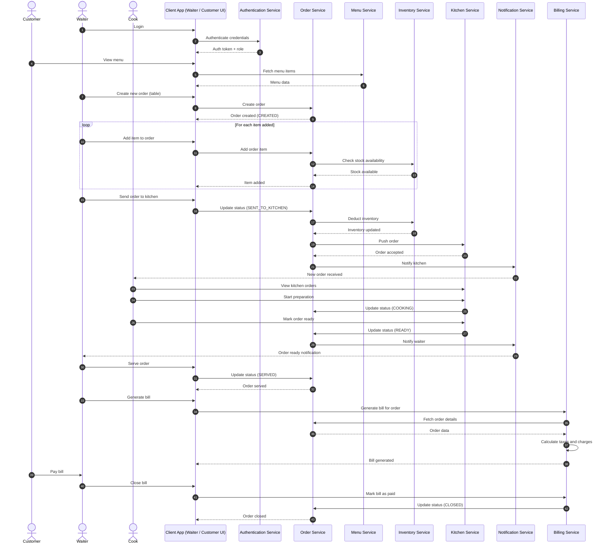

```mermaid
sequenceDiagram
    autonumber

    actor Customer
    actor Waiter
    actor Cook

    participant UI as Client App (Waiter / Customer UI)
    participant Auth as Authentication Service
    participant Order as Order Service
    participant Menu as Menu Service
    participant Inventory as Inventory Service
    participant Kitchen as Kitchen Service
    participant Notify as Notification Service
    participant Billing as Billing Service

    %% Authentication
    Waiter ->> UI: Login
    UI ->> Auth: Authenticate credentials
    Auth -->> UI: Auth token + role

    %% Menu Viewing
    Customer ->> UI: View menu
    UI ->> Menu: Fetch menu items
    Menu -->> UI: Menu data

    %% Order Creation
    Waiter ->> UI: Create new order (table)
    UI ->> Order: Create order
    Order -->> UI: Order created (CREATED)

    %% Add Items
    loop For each item added
        Waiter ->> UI: Add item to order
        UI ->> Order: Add order item
        Order ->> Inventory: Check stock availability
        Inventory -->> Order: Stock available
        Order -->> UI: Item added
    end

    %% Send to Kitchen
    Waiter ->> UI: Send order to kitchen
    UI ->> Order: Update status (SENT_TO_KITCHEN)
    Order ->> Inventory: Deduct inventory
    Inventory -->> Order: Inventory updated
    Order ->> Kitchen: Push order
    Kitchen -->> Order: Order accepted
    Order ->> Notify: Notify kitchen
    Notify -->> Cook: New order received

    %% Cooking Flow
    Cook ->> Kitchen: View kitchen orders
    Cook ->> Kitchen: Start preparation
    Kitchen ->> Order: Update status (COOKING)

    Cook ->> Kitchen: Mark order ready
    Kitchen ->> Order: Update status (READY)
    Order ->> Notify: Notify waiter
    Notify -->> Waiter: Order ready notification

    %% Serving
    Waiter ->> UI: Serve order
    UI ->> Order: Update status (SERVED)
    Order -->> UI: Order served

    %% Billing
    Waiter ->> UI: Generate bill
    UI ->> Billing: Generate bill for order
    Billing ->> Order: Fetch order details
    Order -->> Billing: Order data
    Billing ->> Billing: Calculate taxes and charges
    Billing -->> UI: Bill generated

    %% Payment & Closure
    Customer ->> Waiter: Pay bill
    Waiter ->> UI: Close bill
    UI ->> Billing: Mark bill as paid
    Billing ->> Order: Update status (CLOSED)
    Order -->> UI: Order closed
```