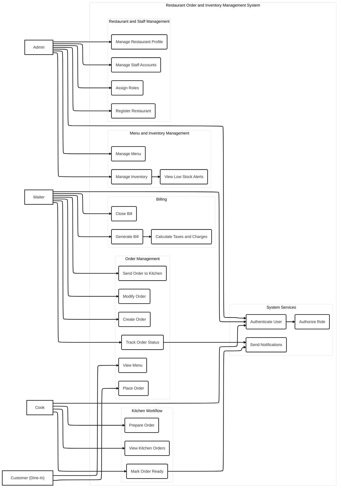

```mermaid
---
config:
  layout: elk
  theme: neo
  look: classic
---
flowchart LR
 subgraph RSM["Restaurant and Staff Management"]
        UC1("Register Restaurant")
        UC2("Manage Restaurant Profile")
        UC3("Manage Staff Accounts")
        UC4("Assign Roles")
  end
 subgraph MIM["Menu and Inventory Management"]
        UC5("Manage Menu")
        UC6("Manage Inventory")
        UC7("View Low Stock Alerts")
  end
 subgraph OM["Order Management"]
        UC8("Create Order")
        UC9("Modify Order")
        UC10("Send Order to Kitchen")
        UC11("Track Order Status")
        UC12("View Menu")
        UC13("Place Order")
  end
 subgraph KW["Kitchen Workflow"]
        UC14("View Kitchen Orders")
        UC15("Prepare Order")
        UC16("Mark Order Ready")
  end
 subgraph BILL["Billing"]
        UC17("Generate Bill")
        UC18("Close Bill")
        UC19("Calculate Taxes and Charges")
  end
 subgraph SYS["System Services"]
        UC20("Authenticate User")
        UC21("Authorize Role")
        UC22("Send Notifications")
  end
 subgraph System["Restaurant Order and Inventory Management System"]
        RSM
        MIM
        OM
        KW
        BILL
        SYS
  end
    Admin["Admin"] --> UC1 & UC2 & UC3 & UC4 & UC5 & UC6 & UC20
    Waiter["Waiter"] --> UC8 & UC9 & UC10 & UC11 & UC17 & UC18 & UC20
    Cook["Cook"] --> UC14 & UC15 & UC16 & UC20
    Customer["Customer (Dine-In)"] --> UC12 & UC13
    UC6 --> UC7
    UC17 --> UC19
    UC20 --> UC21
    UC16 --> UC22
    UC11 --> UC22
```

